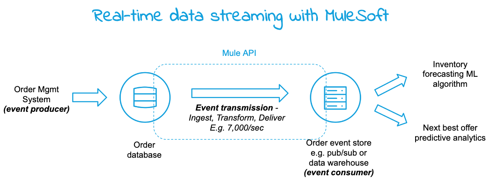

# mule-event-streaming
Event streaming with MuleSoft 

Events are everywhere -- order placed, stocks traded, health condition reported, temperature threshold reached, and so on. Event streaming is “continuous” transmission and/or real-time processing of events as it is generated for making time critical decisions. 

See [DZone article](https://dzone.com/articles/event-streaming-with-mulesoft) for full write-up.
	
At a high-level there are three steps in event processing: 
 - generation (source/producer)
 - transmission (i.e., data movement)
 - processing (destination/consumer)

In many modern/IOT applications the event generator will potentially have the ability to transmit it as well. But in the enterprise setting events typically accumulate in a data store like database and from there it has to be transmitted to the destination for processing. 

For example, the order data (event) is generated by a Distributed Order Management (DOM) and then stored in an Order table. Now you need a solution to stream (continuously transfer at scale) the order data to the destination for analytics processing and take time-sensitive actions like forecasting inventory levels or predicting the next best offer in real-time. 

This project documents a solution to transmit order data as a stream, specifically 7,000 events/sec or 25M/hour. Below is the use case flow diagram and where Mule capability fits in.

